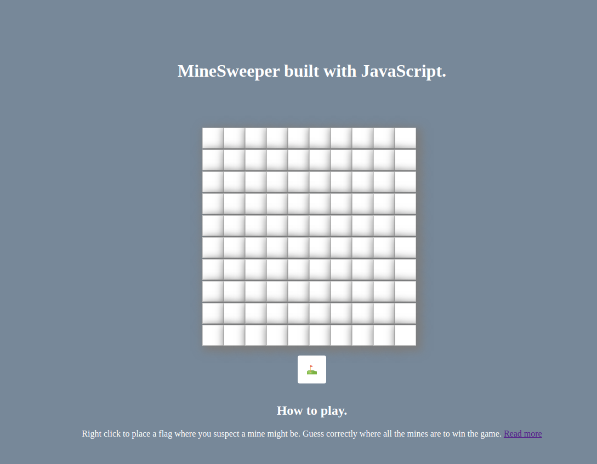

# minesweeper-javascript
A JavaScript minesweeper game. Based on video from TravisMedia video on Youtube.

In this project I:
- Used JavaScript to build minesweeper game;
- Made use of recursion concept in JavaScript

## Built with

- Javascript.
- Webpack.
- Sass.
- Babel
- HTML 5

## Live Demo

[Click here to see see the game!](https://raw.githack.com/Luckyaremu/js-shooter-game/dev-branch/dist/index.html)

## Getting Started

- Clone the repository on your local machine;
- Cd into the folder;
- Run `npm install`;
- Run `npm run serve`;
- Open index.html in dist/ folder;

## Installations

- Install VSCode or any code editor you like;
- Install Live Serve package in VS code.
- Install npm by running `npm install`.

## Author

## 🤝 Contributing

Contributions, issues and feature requests are welcome! Start by:

- Forking the project
- Cloning the project to your local machine
- `cd` into the project directory
- Run `git checkout -b your-branch-name`
- Make your contributions
- Push your branch up to your forked repository
- Open a Pull Request with a detailed description to the development branch of the original project for a review

## Show your support

Give a ⭐️ if you like this project!
=======
